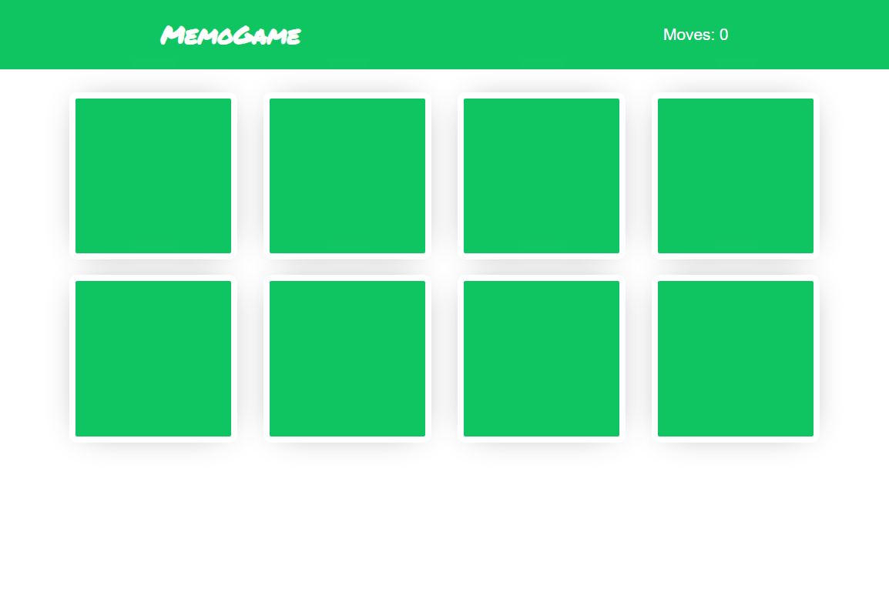

# Memory Game

Simple memory card game created in vanilla JavaScript, HTML and CSS

## Screenshot

## How to run

    #cloning code
    git clone https://github.com/visionpl/nta_memogame.git
    cd nta_memogame

    #install dependencies
    npm install

    #start app
    npm start

Now you can view demo at http://127.0.0.1:8080

